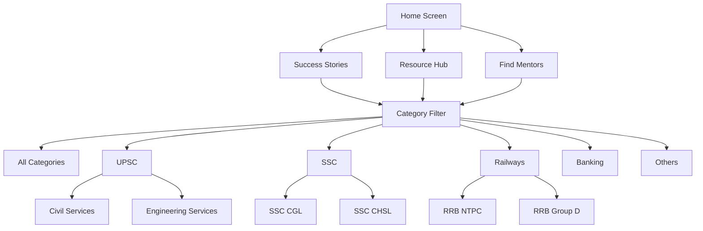

# Design Document: Success Stories and Resources System

## Overview

This document outlines the design for implementing Success Stories, Resource Hub, Enhanced Mentor Discovery, and improved exam categorization system in the AspireBridge platform. The system will provide a comprehensive content ecosystem where achievers can share their experiences and resources while aspirants can discover relevant content and mentors based on specific exam categories.

## Architecture

### High-Level Architecture



### System Components

1. **Content Management System**
   - Success Stories Engine
   - Resource Management
   - Content Categorization
   - Search and Discovery

2. **User Profile Enhancement**
   - Exam Category Selection
   - Achiever Verification
   - Profile Categorization

3. **Discovery and Filtering**
   - Category-based Filtering
   - Search Functionality
   - Recommendation Engine

## Components and Interfaces

### 1. Home Screen Enhancements

**New Sections Added:**
- Success Stories Preview (3-4 recent stories)
- Resource Hub Quick Access
- Enhanced Find Mentors with category tabs

**Layout Structure:**
```
Header (Greeting + Notifications)
├── Quick Stats Cards
├── Quick Actions (Find Mentor, Schedule, Explore Jobs)
├── Success Stories Section ← NEW
├── Resource Hub Access ← NEW
├── Enhanced Find Mentors ← NEW
└── Recent Activity
```

### 2. Success Stories System

**Components:**
- `SuccessStoriesFragment` - Main stories listing
- `SuccessStoryDetailFragment` - Individual story view
- `PostSuccessStoryFragment` - Story creation (Achievers only)
- `SuccessStoryAdapter` - RecyclerView adapter
- `CategoryFilterComponent` - Exam category filtering

**Story Card Layout:**
```
[Achiever Avatar] [Name] [Exam Badge] [Rank] [Year]
[Story Title]
[Story Preview Text...]
[Engagement: Likes, Comments, Shares]
[Read More Button]
```

### 3. Enhanced Exam Categories

**Hierarchical Structure:**
```
UPSC
├── Civil Services (IAS, IPS, IFS)
├── Engineering Services (IES)
├── Forest Services
└── Medical Services

SSC
├── Combined Graduate Level (CGL)
├── Combined Higher Secondary Level (CHSL)
├── Multi Tasking Staff (MTS)
├── Stenographer
├── Junior Engineer (JE)
└── Constable

Railways
├── RRB NTPC
├── RRB Group D
├── RRB Junior Engineer (JE)
├── RRB Senior Section Engineer (SSE)
└── RRB Assistant Loco Pilot (ALP)

Banking
├── SBI (PO, Clerk, SO)
├── IBPS (PO, Clerk, RRB)
├── RBI (Grade A, Grade B)
└── NABARD

Defence
├── NDA/CDS
├── AFCAT
├── Indian Army
├── Indian Navy
└── Indian Air Force
```

### 4. Resource Hub System

**Components:**
- `ResourceHubFragment` - Main resource listing
- `ResourceDetailFragment` - Resource viewer
- `UploadResourceFragment` - Resource upload (Achievers only)
- `ResourceAdapter` - Grid/List adapter
- `ResourceFilterComponent` - Category and type filtering

**Resource Types:**
- PDF Documents
- Video Links
- Study Notes
- Practice Tests
- Strategy Documents
- Time Tables

**Resource Card Layout:**
```
[Resource Thumbnail/Icon]
[Resource Title]
[Achiever Name] [Exam Category Badge]
[Resource Type] [File Size] [Downloads]
[Rating Stars] [Bookmark Icon]
```

### 5. Enhanced Find Mentors

**Components:**
- `FindMentorsFragment` - Enhanced mentor discovery
- `MentorCategoryFragment` - Category-specific mentors
- `MentorProfileFragment` - Detailed mentor profile
- `MentorFilterComponent` - Advanced filtering

**Mentor Card Enhancements:**
```
[Mentor Avatar] [Verification Badge]
[Name] [Current Role]
[Exam Badges: UPSC-2019-Rank 45]
[Specialization Tags]
[Rating] [Sessions Completed]
[Availability Status]
[Connect Button]
```

## Data Models

### Enhanced User Profile
```kotlin
data class AchieverProfile(
    val userId: String,
    val examCategories: List<ExamAchievement>,
    val isVerified: Boolean,
    val specializations: List<String>,
    val mentorRating: Float,
    val totalSessions: Int,
    val successStoriesCount: Int,
    val resourcesSharedCount: Int
)

data class ExamAchievement(
    val examCategory: ExamCategory,
    val examSubcategory: ExamSubcategory,
    val rank: Int?,
    val year: Int,
    val attempts: Int,
    val verificationStatus: VerificationStatus
)
```

### Success Story Model
```kotlin
data class SuccessStory(
    val id: String,
    val authorId: String,
    val title: String,
    val content: String,
    val examCategory: ExamCategory,
    val examSubcategory: ExamSubcategory,
    val rank: Int?,
    val year: Int,
    val attempts: Int,
    val preparationDuration: String,
    val keyTips: List<String>,
    val resources: List<String>,
    val createdAt: Long,
    val likes: Int,
    val comments: Int,
    val shares: Int,
    val isBookmarked: Boolean
)
```

### Resource Model
```kotlin
data class Resource(
    val id: String,
    val title: String,
    val description: String,
    val type: ResourceType,
    val url: String,
    val thumbnailUrl: String?,
    val fileSize: Long?,
    val uploaderId: String,
    val examCategory: ExamCategory,
    val examSubcategory: ExamSubcategory,
    val tags: List<String>,
    val downloads: Int,
    val rating: Float,
    val createdAt: Long,
    val isBookmarked: Boolean
)

enum class ResourceType {
    PDF, VIDEO, NOTES, PRACTICE_TEST, STRATEGY, TIMETABLE, LINK
}
```

### Exam Category Models
```kotlin
data class ExamCategory(
    val id: String,
    val name: String,
    val fullName: String,
    val description: String,
    val iconRes: Int,
    val colorRes: Int,
    val subcategories: List<ExamSubcategory>
)

data class ExamSubcategory(
    val id: String,
    val name: String,
    val fullName: String,
    val parentCategoryId: String,
    val description: String,
    val eligibility: String,
    val examPattern: String
)
```

## User Interface Design

### 1. Enhanced Home Screen

**Success Stories Section:**
- Horizontal scrollable cards showing recent success stories
- Each card shows achiever photo, name, exam badge, and story preview
- "View All" button leading to full Success Stories screen

**Resource Hub Access:**
- Prominent card with resource count and quick access
- Recent resource thumbnails preview
- Category-wise resource count display

**Enhanced Find Mentors:**
- Category tabs (All, UPSC, SSC, Railways, Banking)
- Mentor cards with exam badges and specializations
- Quick filter options (Available Now, Top Rated, etc.)

### 2. Success Stories Screen

**Layout:**
- Top category filter tabs (All, UPSC, SSC, Railways, etc.)
- Search bar with filters
- Story cards in vertical list
- Floating Action Button for achievers to post stories

**Story Detail Screen:**
- Full story content with rich text formatting
- Achiever profile section with exam details
- Engagement buttons (Like, Comment, Share, Bookmark)
- Related stories section
- Comments section

### 3. Resource Hub Screen

**Layout:**
- Category filter tabs
- Resource type filters (PDF, Video, Notes, etc.)
- Grid/List toggle view
- Search and sort options
- Resource cards with preview thumbnails

**Resource Detail Screen:**
- Resource preview/viewer
- Download/bookmark options
- Uploader profile and other resources
- Rating and review system
- Related resources

### 4. Enhanced Registration Flow

**Achiever Registration Enhancements:**
- Exam category selection screen
- Subcategory selection based on main category
- Multiple exam selection support
- Rank and year input for each exam
- Document upload for verification

## Error Handling

### Content Upload Errors
- File size validation (max 50MB for resources)
- File type validation
- Content moderation checks
- Network failure handling with retry mechanism

### Category Selection Errors
- Invalid category/subcategory combinations
- Missing required exam details
- Verification document issues

### Search and Filter Errors
- No results found states
- Network timeout handling
- Invalid search queries

## Testing Strategy

### Unit Tests
- Data model validation
- Category hierarchy logic
- Search and filter algorithms
- Content categorization logic

### Integration Tests
- API integration for content upload/download
- Database operations for categories and content
- User authentication and authorization
- Content moderation workflow

### UI Tests
- Navigation between screens
- Category filter functionality
- Content upload and viewing flows
- Search and discovery features

### Property-Based Tests

**Property 1: Category Consistency**
*For any* content item (success story, resource, mentor profile), the assigned categories should always be valid and consistent with the hierarchical structure
**Validates: Requirements 6.3, 6.4**

**Property 2: Search Result Relevance**
*For any* search query and filter combination, all returned results should match the specified criteria
**Validates: Requirements 9.2, 9.4**

**Property 3: Content Categorization**
*For any* achiever posting content, the system should automatically assign correct categories based on their verified exam profile
**Validates: Requirements 6.1, 6.2**

**Property 4: Filter Consistency**
*For any* category filter applied across different sections (Success Stories, Resources, Mentors), the filtering logic should be consistent
**Validates: Requirements 4.2, 4.3, 4.4**

**Property 5: Hierarchical Category Validation**
*For any* exam subcategory selection, it should always belong to a valid parent category
**Validates: Requirements 2.1, 2.2, 7.2**