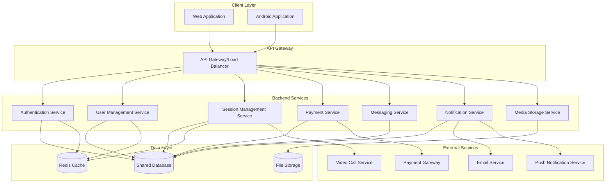
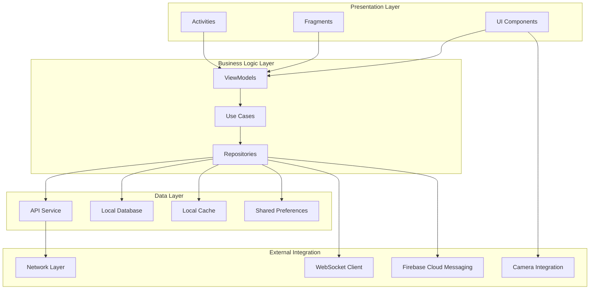

# Design Document - Website Integration

## Overview

This design document outlines the architecture and implementation approach for integrating all features from the MentorConnect website into the Android application while maintaining a shared backend database. The integration will ensure complete feature parity between web and mobile platforms with real-time data synchronization.

## Architecture

### System Architecture



### Mobile Application Architecture



## Components and Interfaces

### 1. Authentication System

**Enhanced Authentication Manager**
```kotlin
interface AuthenticationManager {
    suspend fun loginWithCredentials(email: String, password: String): AuthResult
    suspend fun registerUser(userDetails: UserRegistrationRequest): AuthResult
    suspend fun refreshToken(): TokenResult
    suspend fun logout(): Boolean
    suspend fun resetPassword(email: String): Boolean
    suspend fun verifyEmail(token: String): Boolean
    suspend fun socialLogin(provider: SocialProvider, token: String): AuthResult
}
```

**JWT Token Management**
```kotlin
interface TokenManager {
    fun saveTokens(accessToken: String, refreshToken: String)
    fun getAccessToken(): String?
    fun getRefreshToken(): String?
    fun clearTokens()
    fun isTokenValid(): Boolean
}
```

### 2. Real-Time Synchronization

**WebSocket Manager**
```kotlin
interface WebSocketManager {
    fun connect()
    fun disconnect()
    fun subscribeToUserUpdates(userId: String)
    fun subscribeToSessionUpdates(sessionId: String)
    fun subscribeToMessages(conversationId: String)
    fun sendMessage(message: MessageRequest)
    fun onConnectionStateChanged(callback: (ConnectionState) -> Unit)
}
```

**Sync Manager**
```kotlin
interface SyncManager {
    suspend fun syncUserProfile(): SyncResult
    suspend fun syncSessions(): SyncResult
    suspend fun syncMessages(): SyncResult
    suspend fun syncWalletData(): SyncResult
    suspend fun handleOfflineActions(): SyncResult
}
```

### 3. Enhanced User Management

**User Profile Service**
```kotlin
interface UserProfileService {
    suspend fun getUserProfile(userId: String): UserProfile
    suspend fun updateProfile(profile: UserProfileUpdate): UpdateResult
    suspend fun uploadProfilePhoto(imageUri: Uri): UploadResult
    suspend fun uploadDocument(documentUri: Uri, type: DocumentType): UploadResult
    suspend fun setExpertiseAreas(areas: List<ExpertiseArea>): UpdateResult
    suspend fun setAvailability(schedule: AvailabilitySchedule): UpdateResult
    suspend fun setHourlyRate(rate: Double): UpdateResult
}
```

**Mentor Discovery Service**
```kotlin
interface MentorDiscoveryService {
    suspend fun searchMentors(criteria: SearchCriteria): List<MentorProfile>
    suspend fun getMentorRecommendations(userId: String): List<MentorProfile>
    suspend fun getMentorsByCategory(category: String): List<MentorProfile>
    suspend fun getMentorsByLocation(location: Location, radius: Double): List<MentorProfile>
    suspend fun getMentorDetails(mentorId: String): MentorDetailProfile
}
```

### 4. Session Management System

**Session Booking Service**
```kotlin
interface SessionBookingService {
    suspend fun getAvailableSlots(mentorId: String, dateRange: DateRange): List<TimeSlot>
    suspend fun bookSession(request: SessionBookingRequest): BookingResult
    suspend fun rescheduleSession(sessionId: String, newSlot: TimeSlot): BookingResult
    suspend fun cancelSession(sessionId: String, reason: String): CancellationResult
    suspend fun createRecurringBooking(request: RecurringBookingRequest): BookingResult
    suspend fun getSessionHistory(userId: String): List<SessionHistory>
}
```

**Video Call Integration**
```kotlin
interface VideoCallService {
    suspend fun startVideoCall(sessionId: String): VideoCallResult
    suspend fun joinVideoCall(callId: String): VideoCallResult
    suspend fun endVideoCall(callId: String): Boolean
    suspend fun enableScreenShare(): Boolean
    suspend fun recordSessionNotes(sessionId: String, notes: String): Boolean
}
```

### 5. Messaging System

**Real-Time Messaging Service**
```kotlin
interface MessagingService {
    suspend fun getConversations(userId: String): List<Conversation>
    suspend fun getMessages(conversationId: String, page: Int): List<Message>
    suspend fun sendMessage(conversationId: String, content: MessageContent): SendResult
    suspend fun sendFile(conversationId: String, fileUri: Uri): SendResult
    suspend fun markAsRead(messageId: String): Boolean
    suspend fun getTypingIndicator(conversationId: String): Flow<TypingStatus>
}
```

### 6. Payment System

**Payment Processing Service**
```kotlin
interface PaymentService {
    suspend fun processPayment(request: PaymentRequest): PaymentResult
    suspend fun addFundsToWallet(amount: Double, paymentMethod: PaymentMethod): PaymentResult
    suspend fun withdrawFunds(amount: Double, withdrawalMethod: WithdrawalMethod): WithdrawalResult
    suspend fun getTransactionHistory(userId: String): List<Transaction>
    suspend fun getWalletBalance(userId: String): WalletBalance
    suspend fun processRefund(transactionId: String, reason: String): RefundResult
}
```

### 7. Notification System

**Push Notification Manager**
```kotlin
interface NotificationManager {
    suspend fun registerForNotifications(token: String): Boolean
    suspend fun updateNotificationPreferences(preferences: NotificationPreferences): Boolean
    suspend fun sendSessionReminder(sessionId: String): Boolean
    suspend fun sendMessageNotification(messageId: String): Boolean
    suspend fun sendPaymentNotification(transactionId: String): Boolean
}
```

## Data Models

### Enhanced User Models

```kotlin
data class UserProfile(
    val id: String,
    val email: String,
    val name: String,
    val userType: UserType,
    val profilePhoto: String?,
    val bio: String?,
    val location: Location?,
    val createdAt: Date,
    val lastActive: Date,
    val isVerified: Boolean,
    val verificationDocuments: List<Document>,
    
    // Mentor-specific fields
    val expertiseAreas: List<ExpertiseArea>?,
    val hourlyRate: Double?,
    val availability: AvailabilitySchedule?,
    val achievements: List<Achievement>?,
    val certifications: List<Certification>?,
    val rating: Double?,
    val totalSessions: Int?,
    val successRate: Double?,
    
    // Mentee-specific fields
    val learningGoals: List<String>?,
    val currentLevel: ExperienceLevel?,
    val interests: List<String>?,
    val preferredMentorTypes: List<String>?
)

data class ExpertiseArea(
    val id: String,
    val name: String,
    val category: String,
    val level: ExpertiseLevel
)

data class AvailabilitySchedule(
    val timeZone: String,
    val weeklySchedule: Map<DayOfWeek, List<TimeSlot>>,
    val exceptions: List<ScheduleException>
)
```

### Session Models

```kotlin
data class SessionBooking(
    val id: String,
    val mentorId: String,
    val menteeId: String,
    val scheduledTime: Date,
    val duration: Duration,
    val type: SessionType,
    val status: SessionStatus,
    val price: Double,
    val notes: String?,
    val videoCallId: String?,
    val createdAt: Date,
    val updatedAt: Date
)

data class RecurringBooking(
    val id: String,
    val baseBooking: SessionBooking,
    val recurrencePattern: RecurrencePattern,
    val endDate: Date?,
    val maxOccurrences: Int?
)

enum class SessionType {
    VIDEO_CALL,
    AUDIO_CALL,
    IN_PERSON,
    CHAT_ONLY
}

enum class SessionStatus {
    SCHEDULED,
    IN_PROGRESS,
    COMPLETED,
    CANCELLED,
    NO_SHOW
}
```

### Messaging Models

```kotlin
data class Conversation(
    val id: String,
    val participants: List<String>,
    val lastMessage: Message?,
    val unreadCount: Int,
    val createdAt: Date,
    val updatedAt: Date
)

data class Message(
    val id: String,
    val conversationId: String,
    val senderId: String,
    val content: MessageContent,
    val timestamp: Date,
    val readBy: List<ReadReceipt>,
    val editedAt: Date?
)

sealed class MessageContent {
    data class Text(val text: String) : MessageContent()
    data class File(val fileName: String, val fileUrl: String, val fileType: String, val fileSize: Long) : MessageContent()
    data class Image(val imageUrl: String, val caption: String?) : MessageContent()
    data class SessionInvite(val sessionId: String) : MessageContent()
}
```

### Payment Models

```kotlin
data class WalletBalance(
    val userId: String,
    val balance: Double,
    val currency: String,
    val pendingAmount: Double,
    val lastUpdated: Date
)

data class Transaction(
    val id: String,
    val userId: String,
    val type: TransactionType,
    val amount: Double,
    val currency: String,
    val status: TransactionStatus,
    val description: String,
    val relatedSessionId: String?,
    val paymentMethod: PaymentMethod?,
    val createdAt: Date,
    val completedAt: Date?
)

enum class TransactionType {
    PAYMENT,
    REFUND,
    WALLET_TOPUP,
    WITHDRAWAL,
    COMMISSION,
    BONUS
}
```

## Correctness Properties

*A property is a characteristic or behavior that should hold true across all valid executions of a system-essentially, a formal statement about what the system should do. Properties serve as the bridge between human-readable specifications and machine-verifiable correctness guarantees.*

### Property Reflection

After analyzing all acceptance criteria, I identified several areas where properties can be consolidated:

- Cross-platform synchronization properties (1.2, 1.3, 2.3, 5.3) can be combined into comprehensive sync properties
- Authentication properties (2.1, 2.4, 2.5) can be grouped by authentication flow
- Profile management properties (3.1-3.5) can be combined into comprehensive profile management properties
- Session management properties (4.1-4.5) can be grouped by session lifecycle
- Messaging properties (5.1, 5.2, 5.4, 5.5) can be combined into comprehensive messaging properties
- Payment properties (6.2-6.5) can be grouped by payment flow
- Search and discovery properties (7.1-7.5) can be combined into comprehensive search properties

### Core System Properties

**Property 1: Cross-Platform Data Synchronization**
*For any* user action that modifies data (profile updates, session bookings, messages), the change should be reflected across all platforms within the acceptable sync time window
**Validates: Requirements 1.2, 1.3, 5.3**

**Property 2: Authentication Consistency**
*For any* user credentials that are valid on one platform, they should allow successful authentication on all other platforms
**Validates: Requirements 2.1**

**Property 3: Session Management Integrity**
*For any* session booking, rescheduling, or cancellation operation, the system should maintain data consistency and notify all relevant parties
**Validates: Requirements 4.2, 4.4**

**Property 4: Real-Time Messaging Delivery**
*For any* message sent between users, it should be delivered in real-time to all active sessions and stored for offline access
**Validates: Requirements 5.1, 5.4**

**Property 5: Payment Processing Accuracy**
*For any* payment transaction, the wallet balances should be updated correctly and transaction history should reflect the accurate state
**Validates: Requirements 6.2, 6.3, 6.4**

**Property 6: Search Result Relevance**
*For any* search query with specific filters, all returned results should match the specified criteria
**Validates: Requirements 7.1, 7.4, 7.5**

**Property 7: Notification Delivery Reliability**
*For any* system event that triggers notifications, the appropriate notifications should be sent to all relevant users based on their preferences
**Validates: Requirements 11.1, 11.2, 11.5**

**Property 8: Offline Data Persistence**
*For any* data cached for offline access, it should remain available when the device is offline and sync correctly when connectivity is restored
**Validates: Requirements 12.1, 12.3, 12.4**

**Property 9: Profile Management Completeness**
*For any* profile update operation, all related data should be saved correctly and displayed consistently across all views
**Validates: Requirements 3.1, 3.2, 3.3, 3.5**

**Property 10: Video Call Functionality**
*For any* scheduled session with video call enabled, the video call should start successfully and support all required features
**Validates: Requirements 8.1, 8.2, 8.5**

## Error Handling

### Network Error Handling
- Implement exponential backoff for API retries
- Cache critical data for offline access
- Provide meaningful error messages to users
- Implement circuit breaker pattern for external services

### Authentication Error Handling
- Handle token expiration gracefully with automatic refresh
- Provide clear feedback for authentication failures
- Implement secure logout on security violations
- Handle concurrent login sessions appropriately

### Payment Error Handling
- Implement transaction rollback mechanisms
- Provide detailed error messages for payment failures
- Handle partial payment scenarios
- Implement fraud detection and prevention

### Real-Time Communication Error Handling
- Handle WebSocket connection failures with automatic reconnection
- Implement message queuing for offline scenarios
- Handle duplicate message prevention
- Provide connection status indicators

## Testing Strategy

### Dual Testing Approach
The testing strategy combines unit tests for specific functionality and property-based tests for comprehensive coverage:

**Unit Tests Focus:**
- API integration points
- Authentication flows
- Payment processing logic
- UI component behavior
- Error handling scenarios

**Property-Based Tests Focus:**
- Cross-platform data synchronization (minimum 100 iterations)
- Search and filtering accuracy (minimum 100 iterations)
- Real-time messaging delivery (minimum 100 iterations)
- Payment calculation accuracy (minimum 100 iterations)
- Offline sync reliability (minimum 100 iterations)

**Property Test Configuration:**
- Each property test runs minimum 100 iterations due to randomization
- Tests tagged with format: **Feature: website-integration, Property {number}: {property_text}**
- Each correctness property implemented by a single property-based test
- Integration tests verify end-to-end workflows across platforms

**Testing Tools:**
- **Android**: JUnit 5, Espresso, MockK, Kotest for property-based testing
- **API Testing**: Postman/Newman, REST Assured
- **Performance Testing**: JMeter for load testing
- **Cross-Platform Testing**: Automated testing across web and mobile platforms